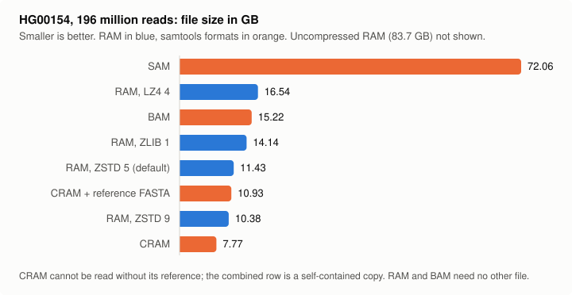

# RAMTools - ROOT Alignment/Map Format Tools

RAMTools provides efficient tools for converting SAM files to ROOT's modern, columnar RNTuple format (RAM - ROOT Alignment/Map) and working with genomic alignment data.

## Features

- High-performance SAM to RAM conversion
- Chromosome-based splitting for parallel processing
- Region-based querying capabilities

## Requirements

- ROOT 6.38+
- C++17 compatible compiler
- CMake 3.16+

## Quick Start
```bash
# 1. Build the tools
mkdir build && cd build
cmake ..
make -j$(nproc)

# 2. Convert a SAM file to the RAM format
./tools/samtoramntuple input.sam output.root

# 3. Query a specific region from the command line
./tools/ramntupleview output.root "chr1:15700-15800"
```

## Command-Line Tools

The primary way to interact with RAMTools is through these command-line executables.

### SAM to RAM Conversion

Convert a standard SAM file into the optimized RNTuple-based RAM format.
```bash
# Basic conversion
./tools/samtoramntuple input.sam output.root

# Split by chromosome for parallel processing
# (Creates output_chr1.root, output_chr2.root, etc.)
./tools/samtoramntuple input.sam output -split
```

Options: `-noindex` skips the region index, `-illumina` stores 8-level binned
quality scores, `-dropqual` stores none, `-compression N` sets the ROOT
compression code (algorithm*100+level; the default 505 is ZSTD level 5).

The index needs the input in coordinate order. An unsorted input converts
fine but gets no index, and region queries on it read the whole file.

### Region Querying

Count the records overlapping a genomic region, as `samtools view -c` does.
```bash
# Usage: ./tools/ramntupleview [input.root] "[chromosome]:[start]-[end]"
./tools/ramntupleview output.root "chr1:10150-10300"
```

### Dumping back to SAM

`ramdump` writes a RAM file out as SAM and takes the `samtools view` options
`-h`, `-H`, `-c`, `-f`, `-F` and `-o`, so its output can be checked against
samtools directly.
```bash
# The whole file with its header; should reproduce the input SAM
./tools/ramdump -h output.root > roundtrip.sam

# Count primary alignments in a region
./tools/ramdump -c -F 0x900 output.root "chr1:10150-10300"
```

## Benchmarks

HG00154 from the 1000 Genomes Project: 196,040,370 records, 72.06 GB as SAM, coordinate sorted, GRCh37 reference names (`1`, not `chr1`). Run on 4 cores with 11 GB of memory, input and output on the same hard disk, samtools 1.13 with 4 threads, `samtoramntuple` on one thread. Every output holds the same 196,040,370 records. Query times are for the binary-search seek of #83.

### File size and conversion time



| Format | Size (GB) | vs BAM | Wall | CPU (s) |
|--------|-----------|--------|------|---------|
| SAM | 72.06 | | | |
| BAM, `samtools view -b` | 15.22 | 1.00x | 24:08 | 3,589 |
| CRAM, `samtools view -C -T ref.fasta` | 7.77 | 1.96x | 12:34 | 1,817 |
| CRAM + reference FASTA | 10.93 | 1.39x | | |
| RAM, `-compression 505` (ZSTD 5, default) | 11.43 | 1.33x | 1:30:06 | 5,258 |
| RAM, `-compression 509` (ZSTD 9) | 10.38 | 1.47x | 14:26:39 | 51,397 |
| RAM, `-compression 101` (ZLIB 1) | 14.14 | 1.08x | 35:27 | 1,859 |
| RAM, `-compression 404` (LZ4 4) | 16.54 | 0.92x | 1:06:59 | 3,710 |
| RAM, `-compression 0` | 83.71 | 0.18x | 44:19 | 1,278 |

A CRAM cannot be read without its reference, so the combined row is the size of a self-contained copy. samtools compressed on four threads, so CPU time is the comparable column. ZSTD 9 is the only setting that comes in under CRAM plus its reference, at ten times the conversion time of ZSTD 5 for 9% less space.

### Region queries

Records overlapping a region, counted with `samtools view -c` for BAM and CRAM and `ramdump -c` for RAM (ZSTD 5). Best of three runs, warm cache. All three formats return the same records for every region.

| Region | Records | BAM (s) | CRAM (s) | RAM (s) |
|--------|---------|---------|----------|---------|
| 100 bp, `1:1000000-1000100` | 2 | 0.15 | 0.10 | 0.48 |
| BRCA2, `13:32889611-32973805` | 6,057 | 0.10 | 0.09 | 0.39 |
| 10 Mb, `1:10000000-20000000` | 582,985 | 0.80 | 1.75 | 0.40 |
| 100 Mb, `2:1-100000000` | 7,048,385 | 8.59 | 21.43 | 0.85 |

A RAM query spends about 0.4 s starting ROOT and opening the file, then finds the region by binary search and counts about 15 million records per second, since a count reads only the position and CIGAR columns. It is slower than samtools on small regions and faster from about 10 Mb up.

### Compression codecs

Sizes on a 2 million record slice of the same sample (734 MB as SAM, 162 MB as BAM), one thread. LZMA 9 gives the same size as LZMA 7. Without compression the file is larger than the SAM because every string and vector column carries an offset column.

| Flag | Codec | Size (MB) | vs BAM | Conversion (s) |
|------|-------|-----------|--------|----------------|
| 0 | none | 857.1 | 0.19x | 18 |
| 404 | LZ4 4 | 175.1 | 0.93x | 26 |
| 101 | ZLIB 1 | 149.8 | 1.08x | 20 |
| 505 | ZSTD 5 (default) | 121.7 | 1.33x | 53 |
| 207 | LZMA 7 | 115.4 | 1.40x | 352 |
| 509 | ZSTD 9 | 111.1 | 1.46x | 523 |

Query time on the full file for each codec, `ramdump -c`, best of three.

| Codec | 10 Mb (s) | 100 Mb (s) |
|-------|-----------|------------|
| none | 0.55 | 0.88 |
| LZ4 4 | 0.46 | 0.79 |
| ZLIB 1 | 0.52 | 1.11 |
| ZSTD 5 | 0.51 | 0.90 |
| ZSTD 9 | 0.53 | 0.91 |

The codec makes little difference to a query: decompressing the three columns a count reads is a small part of its time.
